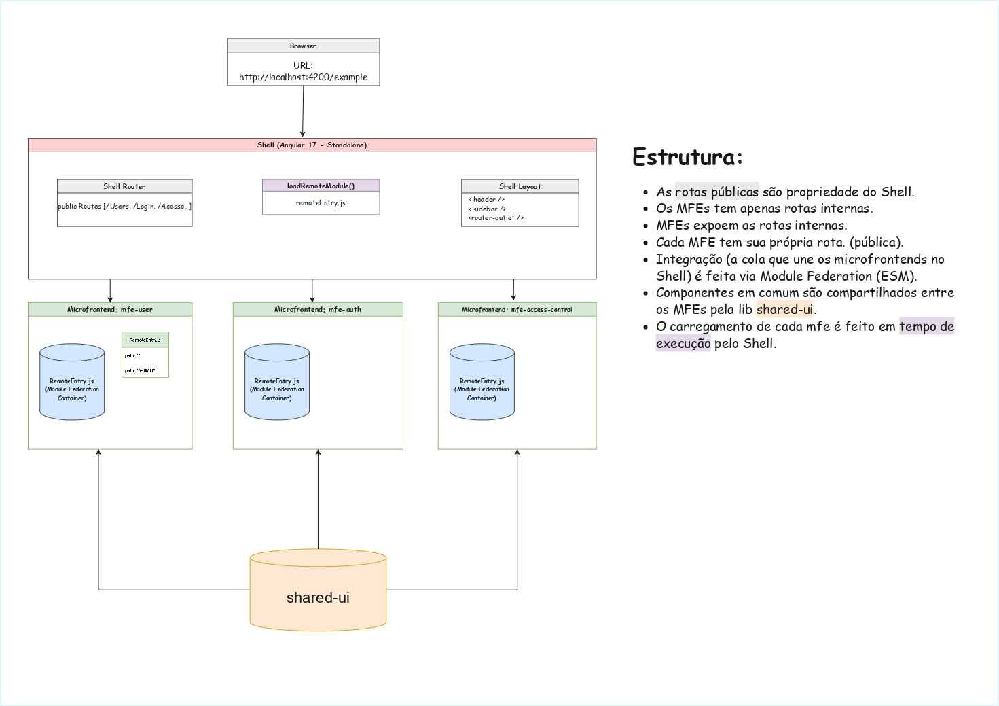

## Sobre

Aplicação Frontend para gestão de Usuários, Papéis, Permissões, Recursos e Progressão de Docente em um Sistema de Gestão Unificado, desenvolvido para um contexto Institucional e Acadêmico.

Esta é a **versão 1.0.0**, correspondente à primeira entrega estável do projeto, apresentada como **DEMO**.

## Escopo da Versão

A versão 1.0.0 contempla as seguintes funcionalidades:

- Edição e listagem de Usuários;
- Cadastro, edição e listagem de Papéis;
- Cadastro, Edição e listagem de Permissões;
- Edição e listagem de Recursos;
- Associação de Usuários a Papéis;
- Definição e gerenciamento de Permissões;
- Gerenciamento de Recursos vinculados às Permissões;
- Listagem de dados com paginação;
- Interface funcional para demonstração (DEMO), com padrões visuais consistentes e fluxos de navegação estruturados.


## Arquitetura 

Este projeto faz parte de uma Prova de Conceito (PoC) baseada em arquitetura de **Micro Frontends**, utilizando **Module Federation** para composição de aplicações frontend independentes.

A descrição detalhada da arquitetura, estrutura dos microfrontends, responsabilidades de cada aplicação e cenários de uso está documentada no arquivo abaixo:

>[Micro Frontends – PoC](docs/microfrontends-poc.md)



_Author: Gabrielly Amorin — 2026 — Microfrontend PoC_

Versão completa:
[PDF](./docs/Arquitetura.pdf)

## Stack Tecnológica

- Angular 17 (versão mais estável para MicroFrontends)
- TypeScript
- SCSS
- Webpack 5 (Module Federation)
- Prettier

## Como Rodar o Projeto

Navegue para a pasta de Workspace:
```cd sigaa-mf-workspace```

Instale as dependências do projeto:
```npm install```

Se for a primeira vez buildando o projeto, builde todos os mfes:
```npm run:run all```

## Scripts Úteis

Para formatar o projeto com Prettier:
```npm run format```
